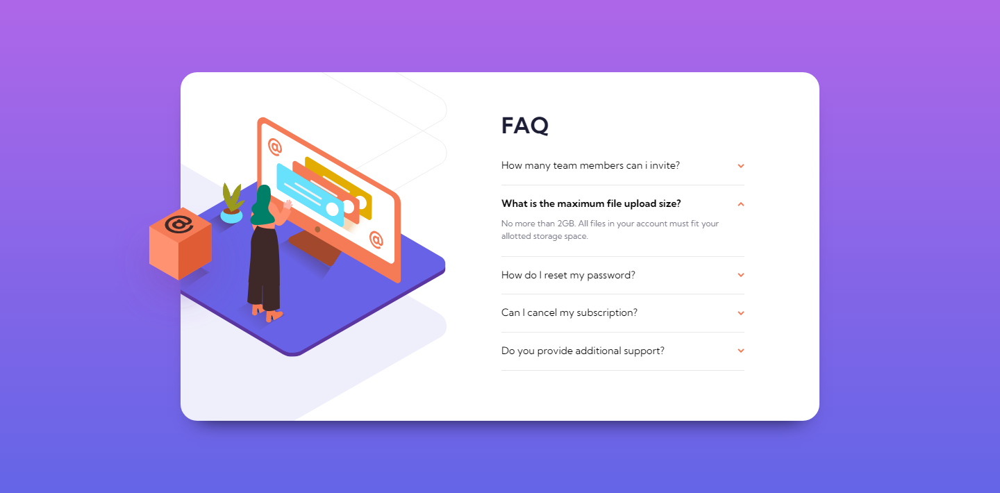

# Frontend Mentor - FAQ accordion card solution

This is a solution to the [FAQ accordion card challenge on Frontend Mentor](https://www.frontendmentor.io/challenges/faq-accordion-card-XlyjD0Oam). Frontend Mentor challenges help you improve your coding skills by building realistic projects. 

## Table of contents

- [Overview](#overview)
  - [The challenge](#the-challenge)
  - [Screenshot](#screenshot)
  - [Links](#links)
- [My process](#my-process)
  - [Built with](#built-with)
  - [What I learned](#what-i-learned)
  - [Continued development](#continued-development)
  - [Useful resources](#useful-resources)
- [Author](#author)

## Overview

### The challenge

Users should be able to:

- View the optimal layout for the component depending on their device's screen size
- See hover states for all interactive elements on the page
- Hide/Show the answer to a question when the question is clicked

### Screenshot



### Links

- HTML Solution: [HTML](https://github.com/JustANipple/faq-accordion-card/blob/master/index.html)
- CSS Solution: [CSS](https://github.com/JustANipple/faq-accordion-card/blob/master/style.css)
- JS Solution: [JS](https://github.com/JustANipple/faq-accordion-card/blob/master/script.js)
- Live Site URL: [LIVE](https://justanipple.github.io/faq-accordion-card/)

## My process

### Built with

- Semantic HTML5 markup
- CSS custom properties
- Flexbox
- CSS Grid
- Mobile-first workflow
- [Styled Components](https://styled-components.com/) - For styles
- JS animations
- Josh's Custom CSS Reset

### What I learned

The JS part was a mess. The first code i made used multiple Arrays containing all the elements that i needed.
I couldn't believe such a simple animation had to involve so many lines of code and after a bit of research i learned that i could move between children and parents of a block without having all of them saved into variables 

This is how i made the page work:
```js
    if(window.getComputedStyle(this.children[2]).display === "none") {
        for(const box of boxArray) {
            box.children[0].style.fontWeight = fwReg;
            box.children[1].style.transform = "rotate(0deg)";
            box.children[2].style.display = "none";      
        }        
        this.children[0].style.fontWeight = fwBold;
        this.children[1].style.transform = "rotate(180deg)";
        this.children[2].style.display = "block";
    } else {
        this.children[0].style.fontWeight = fwReg;
        this.children[1].style.transform = "rotate(0deg)";
        this.children[2].style.display = "none";  
    }
```

Picking the right children of the outer box of every faq was the best solution i could think of

### Continued development

I need to work on organizing images, because getting the image to change and be responsive while not overflowing was a challenge
I still don't know basics stuff in JS, so i'll keep working on that too

### Useful resources

- [Element children](https://developer.mozilla.org/en-US/docs/Web/API/Element/children) - This helped to organize my JS
- [Picture element](https://developer.mozilla.org/en-US/docs/Web/HTML/Element/picture) - This reminded me of some features i forgot about the picture element and made possible to have responsive images on different screen width

## Author

- Frontend Mentor - [@JustANipple](https://www.frontendmentor.io/profile/JustANipple)
